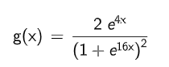

# Material Carousel

This is the example of Material 3 Carousel using ReactJS.


## Demo

View demo at [https://carousel.andrax.dev/](https://carousel.andrax.dev/)

## Requirements

```bash
npm install react-device-detect@2.2.3
```

> [!NOTE]
> 
> However, you can use this component without `react-device-detect` package, but scrolling on mobile devices will not work without it.

## Usage

```js
<Carousel urls={urls} supportSnap={false}/>
```

Where `urls` is an array of image URLs and `supportSnap` is a boolean value that enables snapping to the closest item.

## How it was created

Width of all elements is calculated dynamically based on the scroll width using the following formula:

<div style="text-align:center"></div>

Where x is scroll width + item offset. Each new item has offset of 110px. Scroll width is a virtual parameter as carousel elements only changes their width to simulate scrolling effect.

## License

```
Copyright (c) 2024 Dmytro Ostapenko. All rights reserved.

Licensed under the Apache License, Version 2.0 (the "License");
you may not use this file except in compliance with the License.
You may obtain a copy of the License at

  http://www.apache.org/licenses/LICENSE-2.0

Unless required by applicable law or agreed to in writing, software
distributed under the License is distributed on an "AS IS" BASIS,
WITHOUT WARRANTIES OR CONDITIONS OF ANY KIND, either express or implied.
See the License for the specific language governing permissions and
limitations under the License.

```